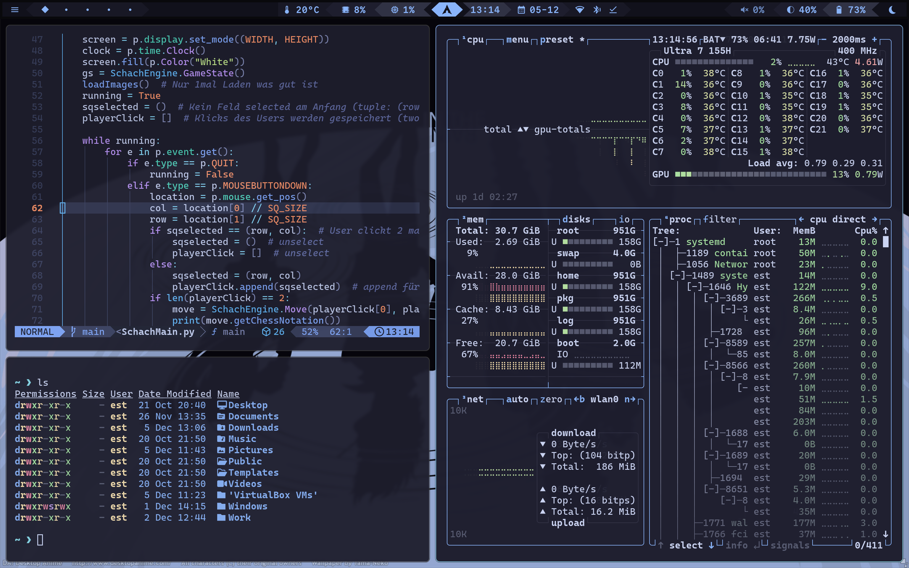

# 👑 OmarchyDotFiles

My personal collection of dotfiles for my **Linux setup**. This repository is where I meticulously manage and track all my configurations for the essential tools I use daily.

## 🚀 Key Features

* **Modular Design:** Easy to adapt, extend, and reuse. Feel free to fork, customize, and tailor it to your specific needs.
* **Aesthetic Focus:** Features carefully selected color palettes, modern fonts, and unified themes for a pleasant and **"fancy"** terminal and desktop experience.

## 🖥️ Screenshots

My current Hyprland setup:

## 🛠️ Utility Scripts

This section contains various helper scripts for managing the configuration.

Script | Description | Notes |
| :--- | :--- | :--- |
| **`alacrittyToGhostty.sh`** | Copies your `alacritty.toml` color settings directly into `ghostty.conf`, ensuring color parity between your terminals. | **⚠️ Requires `sudo`** to create the theme directory in `/usr/share/ghostty/`. |
| **`setup-omarchy.sh`** | Copies the saved dotfiles from the repository to the local configuration path and creates a symbolic link in the `config/omarchy/themes` directory. | This is the primary script for initial setup. |
| **`GetDotfiles.sh`** | Synchronizes your current, actively-used dotfiles *back* into this repository. | Includes an option to **commit and push** your changes for permanent saving. |
